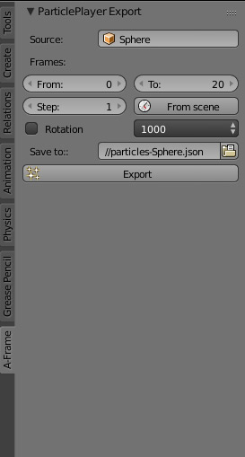

# Blender exporter add-on

## Installation

1. Clone the repo or just download [particleplayer.py](https://raw.githubusercontent.com/feiss/aframe-particleplayer-component/master/exporters/blender/particleplayer.py).
2. Open Blender and open preferences window `File > User Preferences...`
3. Click on the button `Install Add-on from File...` (on the bottom of the window) and find `particleplayer.py` on your disk.
4. Click on the checkbox to activate the add-on.
5. Click on "Save User Settings" if you want to keep the add-on installed permanently (if not, you'll have to repeat previous steps each time you start Blender).

## Usage

You will find the exporter in the tools sidebar on the left, in the **A-Frame** tab on the bottom.

+ **Source**: Current selected object, which must have a particle system attached. You can type another name here to rename the object.
+ **Frames**: Use these fields to select which frames of the animation you want to export
  + **From**: First frame
  + **To**: Last frame
  + **Step**: If you want to export one each X frames. Use `1` for exporting all frames, `2` for exporting one each two frames, etc.
  + **From scene**: Click this button to fill `From` and `To` fields automatically from the current animation range in the scene.
+ **Rotation**: Check if you want to export the rotation of the particles too (not only the position).
+ **Precision / 1000**: Precision of the values to export. More zeroes, more precision.
+ **Save to**: Output file path. By default a filename is set using the object's name, but you can change it.

All parameters determine final file size. If you want a smaller file, try reducing `precision`, increasing `step`, or not exporting the `rotation` if is not necessary.

To preview particles in blender and finetune initial rotation, use a textured plane object in **render / dupli objects** with `rotation` option on:

